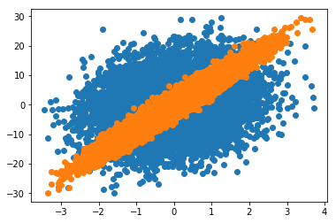

```python
#%%
from sklearn.linear_model import LinearRegression as LR
from sklearn.metrics import mean_squared_error as mse
import numpy as np
from matplotlib import pyplot as plt
#%%
```

# Generate Fake Data

Generate some simple data


```python
# data generating process:
# y = theta_1 x_1 + theta_2 x_2 + epsilon*N(0,1)
theta1 = 2
theta2 = 8
full_size = 10000
x1 = np.random.normal(0,1,full_size)
x2 = np.random.normal(0,1,full_size)
epsilon = 1e-1
noise = epsilon*np.random.normal(0,1,full_size)
y = theta1*x1 + theta2*x2 + noise
```


```python
#%%
plt.plot(x1,y,'o')
plt.plot(x2,y,'o')
```


    [<matplotlib.lines.Line2D at 0x24dbb4501d0>]





## train a model 

Goal is to find the "true" $q^{**}$


```python
#%%
Xtrain = np.stack([x1,x2],axis=1)
ytrain = y
lr = LR()
lr.fit(Xtrain,ytrain)
lr.coef_
#%%
ypred = lr.predict(Xtrain)
J2 = mse(ytrain,ypred)
qstarstar_true = lr.coef_
print("Value of the overall cost function: %s"%J2)
print("True qstarstar: %s"%qstarstar_true)
```

    Value of the overall cost function: 0.009996492589379156
    True qstarstar: [2.00042146 8.00149634]
    

In order to find $\delta q$ using our method we need the new data $X_2$ (with the new training labels $y_2$), the original optimal parameters $q^*$, and the Hessian $\frac{\partial^2}{\partial \vec{q}^2}S_1(q^*,X_1)$. For linear least squares this is known. The gradient is $-X^{T}(y-Xq)$ and the hessian is $X^{T}X$. We define the function dq below which computes $\delta q$ with the necessary information for a linear regression.

Note that in general you'll have to write your own function based on the hessian and gradient of the model you're using. Also, we need to save the hessian ("hess1") from the original model. That's the only piece of information we need that depends on $X_1$, everything else depends only on $X_2$ and $y_2$


```python
#%%
def dq(x2, y2, qstar, hess1):
    hess2 = x2.T @ x2
    M = hess1+hess2
    return np.linalg.inv(M)@(x2.T)@(y2-x2@qstar)

#%%
```

Now let's test if it works. for $X_1$ we'll use 98% of the data. $q^*$ will be the coefficients of the model that trained on X1. Finally, we need to store the hessian for model 1. 


```python
X1 = Xtrain[:9800]; y1 = y[:9800]
X2 = Xtrain[9800:]; y2 = y[9800:]
lr1 = LR()
lr1.fit(X1,y1)
qstar = lr1.coef_
hess1 = X1.T@X1
delta_q = dq(X2,y2,qstar,hess1)
```


```python
#%%
qstarstar_pred = qstar+delta_q
nrmse = ((((qstarstar_pred - qstarstar_true)**2).sum())**.5)/qstarstar_true.mean()
nrmse_zeroth_order = ((((qstar - qstarstar_true)**2).sum())**.5)/qstarstar_true.mean()
perc_improve = round(100*nrmse/nrmse_zeroth_order,2)
print("NRMSE (normalized root mean squared error):  %s"%str(nrmse))
print("only %s percent the normalized error as zeroth order prediction"%str(perc_improve))
```

    NRMSE (normalized root mean squared error):  7.053607045078287e-08
    only 0.24 percent the normalized error as zeroth order prediction
    

It works quite well! 


```python

```
